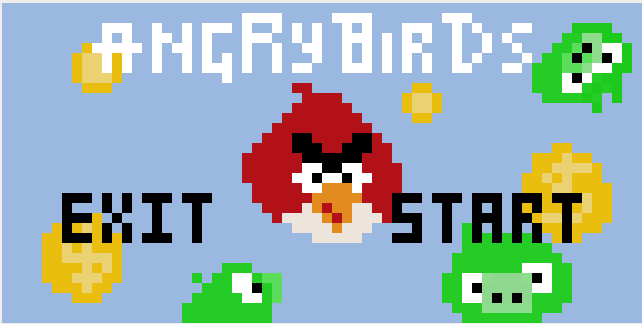
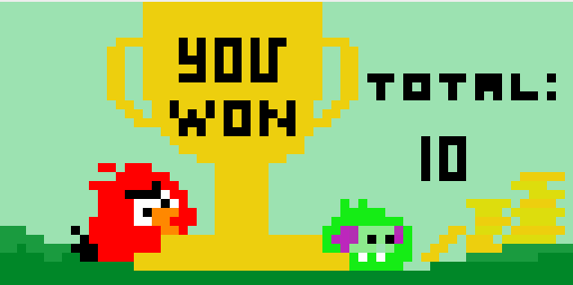
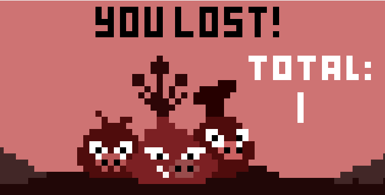
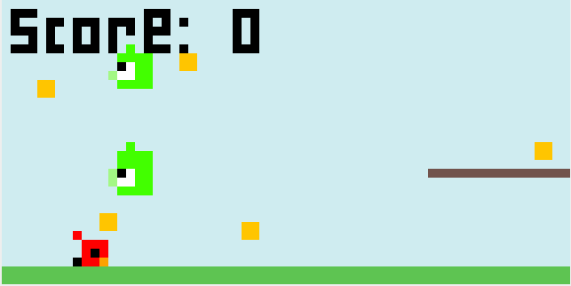

# Coin Quest Platform Game
This game is called: Pig Panic Coin Quest and it is a platform game based on the theme of Angry birds.

Video Link: https://youtu.be/WIFcdk-GruE

## About this Project
This Assembly game is written for the MIPS processor. The goal of the game is to try and collect all the coins without getting hit by the enemy (pigs), in order to move on to the next level! You are the "angry bird" and if you get hit, then you have to restart from the beginning. Each level will get harder to pass. 

Bitmap Display Configuration:
- Unit width in pixels: 8
- Unit height in pixels: 8
- Display width in pixels: 512
- Display height in pixels: 256
- Base Address for Display: 0x10008000 ($gp)

## Images of the game

